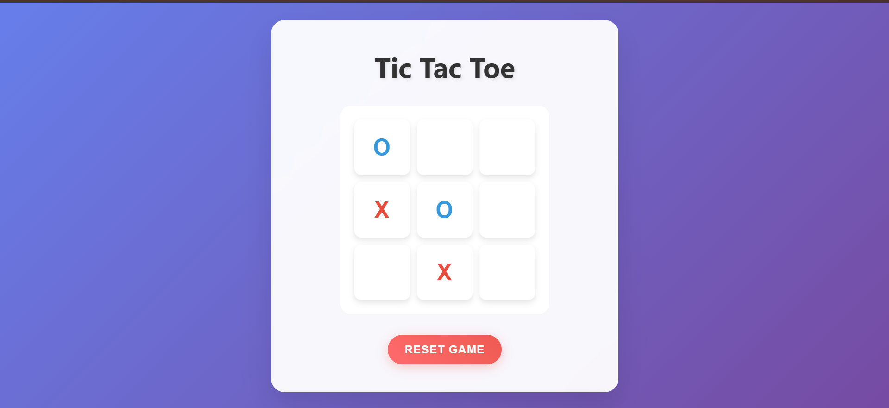

# 🎮 Tic Tac Toe Game

A simple, interactive, and responsive **Tic Tac Toe** game built using **HTML, CSS, and JavaScript**.  
The game supports **two players (X and O)**, highlights winning moves, and displays a popup message for win/draw results.

---

## ✨ Features
-  **Two-player mode** (X and O alternate turns)  
-  **Winning highlight** (winning cells turn gold)  
-  **Responsive design** (works on desktop and mobile)  
-  **Popup message** announcing the winner or draw  
-  **Reset & New Game** options  

## 📸 Demo

## 🛠️ Tech Stack
- **HTML5** → Structure of the game  
- **CSS3** → Styling, animations, responsiveness  
- **JavaScript (Vanilla)** → Game logic and interactivity  

## 🚀 How to Play
1. Open the game in your browser.  
2. Player **O** starts first.  
3. Click on any empty box to place your mark (`X` or `O`).  
4. The game checks after each turn for a winner or a draw.  
5. If a player wins, the winning cells are highlighted.  
6. Use **RESET GAME** or **NEW GAME** to start again.  

## 📂 Project Structure
TicTacToe/
│── index.html # Main HTML file
│── style.css # Embedded CSS (inside index.html)
│── script.js # Embedded JS (inside index.html)

## 🎨 Responsive Design
- Works smoothly on **desktop, tablet, and mobile devices**.  
- Grid layout adapts based on screen size.  

## 📌 Future Improvements
- 🎵 Add sound effects for moves and wins.  
- 🤖 Add **AI opponent** mode (single-player).  
 

## 📜 License
This project is free to use and modify for learning purposes.  

👩‍💻 **Developed by:** Khushi Gupta  
